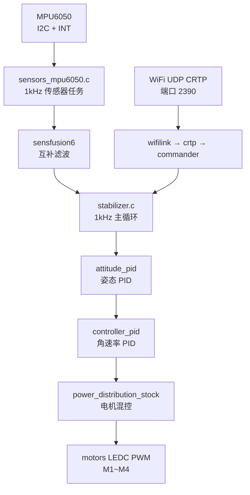

# 架构说明

ESP-Drone Lite 只保留一条最短自稳定链路：**MPU6050 → 互补滤波 → 姿态 PID → 电机混控**，指令入口是 WiFi CRTP。

## 数据流

## 关键任务

| 任务 | 周期/优先级 | 职责 |
|---|---|---|
| `sensorsTask` | MPU INT 触发 | 读 14 字节 acc+gyro，去零偏、低通滤波后入队 |
| `stabilizerTask` | 1kHz | 取传感器与设定值，跑滤波 + PID + 混控 |
| `wifiLinkTask` | UDP | CRTP 包收发（setpoint / log / param） |
| `pmTask` | 100ms | 电源状态机（Lite 版电压为标称值） |

## 状态估计与控制器

Lite 版只保留两种实现，枚举其余选项已删除：

- **估计器**：`complementaryEstimator`（互补滤波，sensfusion6），无 Kalman/EKF；
- **控制器**：`ControllerTypePID`（attitude + rate 双环 PID），无 INDI / Mellinger。

> [!info] 为什么不要 EKF
> EKF 需要光流/ToF/气压计等绝对位置观测源；Lite 版硬件只有 IMU，互补滤波足以支撑姿态自稳，且省去大量代码与算力。详见 [[05-裁剪记录]]。

## 源码地图

| 目录 | 内容 |
|---|---|
| `components/core/crazyflie/modules` | stabilizer、commander、attitude_pid、controller_pid、estimator_complementary |
| `components/core/crazyflie/hal` | sensors_mpu6050、wifilink、pm_esplane、ledseq |
| `components/core/crazyflie/utils` | filter、cf_math、configblock（stub）、FreeRTOS 配置 |
| `components/drivers` | i2c_bus、mpu6050、motors、led、wifi、esp_timer |
| `components/platform` | S2 单机型平台配置（`ED12`） |
| `main` | app_main 入口与 Kconfig |

## 相关笔记

- 飞起来之前：[[01-硬件与接线]] → [[02-焊接步骤]] → [[03-编译与烧录]]
